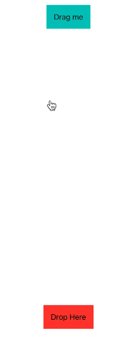

# DragAndDrop

# Installation

In Xcode go to `File -> Add Packages... -> Search or Enter Package URL` and paste in the repo's url: [https://github.com/pedroesli/DragAndDrop](https://github.com/pedroesli/DragAndDrop)

## How to use

To use DragAndDrop first you must use `InteractiveDragDropContainer` to contain the `DragView` and `DropView` inside and give the proper functionality. `DragView` will have a unique `UUID` so that `DropView` will be able to identify what view it can receive.

### Simple example where the DropView is allowed to receive from only the specified ID:

```swift
let id = UUID()
    
var body: some View {
    InteractiveDragDropContainer{
        VStack{
            DragView(id: id) { dragInfo in
                Text(dragInfo.isDragging ? "Im being dragged" : "Drag me")
                    .padding()
                    .background{
                        Color.mint
                    }
            }
            Spacer()
            DropView(receiveFrom: id) { dropInfo in
                if !dropInfo.didDrop{
                    Text("Drop Here")
                        .padding()
                        .background{
                            dropInfo.isColliding ? Color.green : Color.red
                        }
                }
                else{
                    Text("Dropped")
                        .padding()
                        .background{
                            Color.mint
                        }
                }
            }
        }
    }
}
```



### DropView can also receive from any DropView by not setting the receiveFrom parameter

```swift
let id = UUID()
let id2 = UUID()
    
var body: some View {
    InteractiveDragDropContainer{
        VStack{
            DragView(id: id) { dragInfo in
                Text(dragInfo.isDragging ? "Im being dragged" : "Drag me 1")
                    .padding()
                    .background{
                        dragInfo.isColliding ? Color.purple : Color.mint
                    }
            }
            DragView(id: id2) { dragInfo in
                Text(dragInfo.isDragging ? "Im being dragged" : "Drag me 2")
                    .padding()
                    .background{
                        dragInfo.isColliding ? Color.purple : Color.mint
                    }
            }
            Spacer()
            DropView { dropInfo in
                Text(dropInfo.didDrop ? "Dropped" : "Drop Here 1")
                    .padding()
                    .background{
                        dropInfo.isColliding ? Color.green : Color.red
                    }
            }
            .onDragViewReceived { receivingViewID in
                print(receivingViewID)
            }
            DropView { dropInfo in
                Text(dropInfo.didDrop ? "Dropped" : "Drop Here 2")
                    .padding()
                    .background{
                        dropInfo.isColliding ? Color.green : Color.red
                    }
            }
            .onDragViewReceived { receivingViewID in
                print(receivingViewID)
            }
        }
    }
}
```

# DragView

## onDraggingEndedAction

```swift
DragView(id: id) { dragInfo in
    Text(dragInfo.isDragging ? "Im being dragged" : "Drag me")
        .padding()
        .background{
            Color.mint
        }
}
.onDraggingEndedAction { isSuccessfullDrop in
    print("I stopped dragging and dropped: \(isSuccessfullDrop)")
}
```

# DropView

## onDragViewReceived
An action that is called when the drag view has been released on this DragView and has been recieved accordingly.

```swift
DropView(receiveFrom: id) { dropInfo in
    if !dropInfo.didDrop{
        Text("Drop Here")
            .padding()
            .background{
                dropInfo.isColliding ? Color.green : Color.red
            }
    }
    else{
        Text("Dropped")
            .padding()
            .background{
                Color.mint
            }
    }
}
.onDragViewReceived { receivingViewID in
    print(receivingViewID)
}
```

# Future Updates

- [ ]  Replace the UUID to identify the views with the protocol Identifiable to be more generic.
- [ ]  Allow the user to decide whether to hide the DragView or not.
- [ ]  Fix collision bugs.
